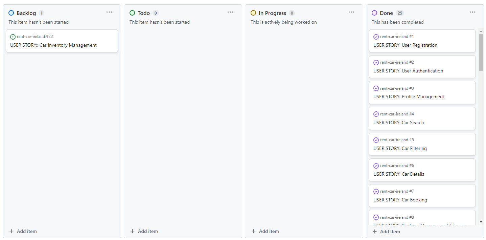
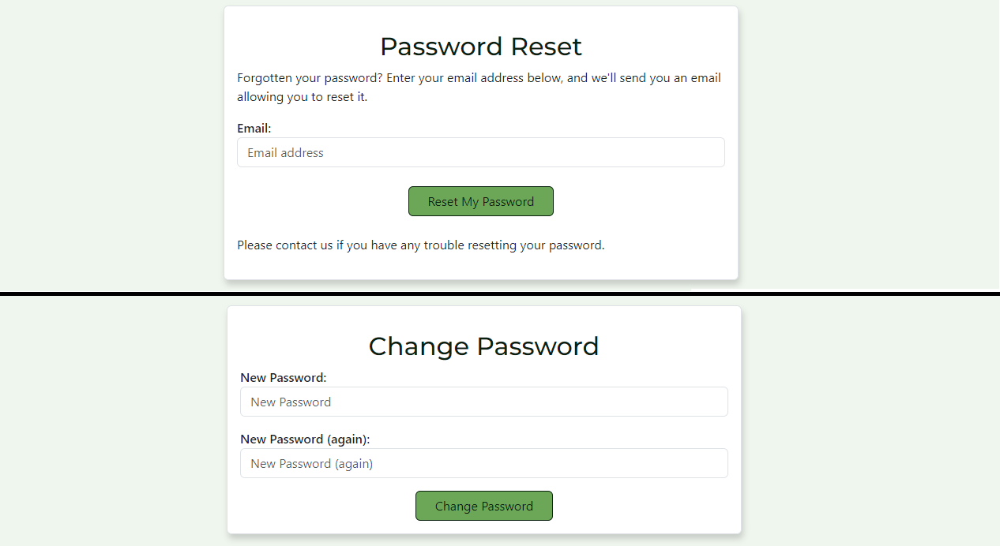
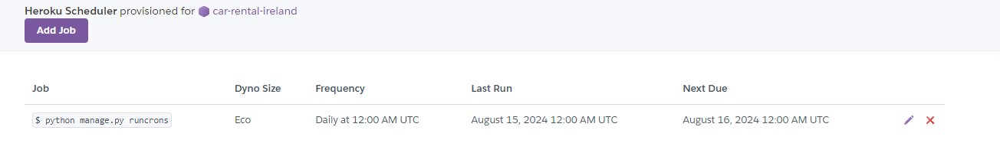
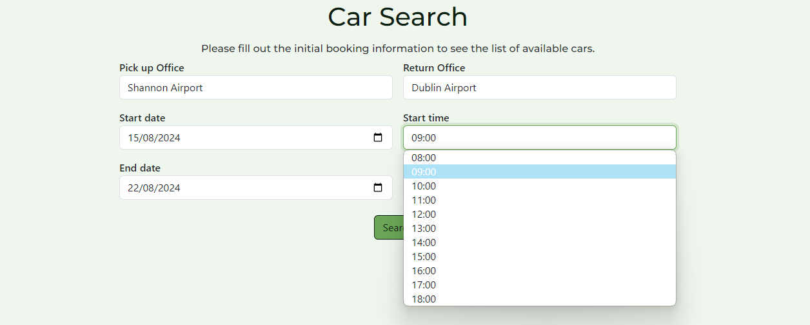
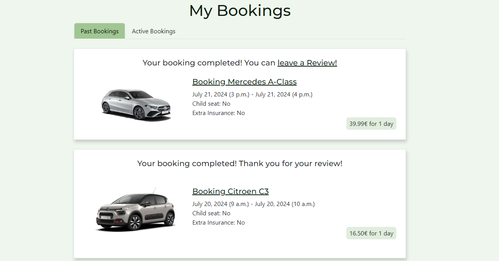
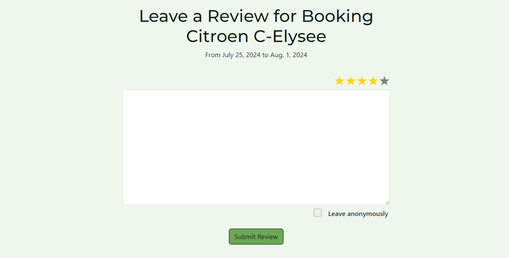

# EireWheels Car Rental

EireWheels Car Rental is an advanced full-stack web application designed for educational purposes, demonstrating a streamlined car rental solution for users in Ireland. This responsive site, built with Django, features a user-friendly interface for managing vehicle rentals at various airports across the country.

### [Link to the EireWheels live website](https://car-rental-ireland-4e20ecc4b192.herokuapp.com/)

## Table of Contents

- [Overview](#overview)
- [Agile Methodology](#agile-methodology)
- [UX](#ux)
   * [Strategy](#strategy)
   * [Scope](#scope)
   * [Structure](#structure)
   * [Skeleton](#skeleton)
   * [Surface](#surface)
- [Existing Features](#existing-features)
   * [Account Management](#account-management)
   * [CRUD Functionality](#crud-functionality)
   * [Heroku Scheduler](#heroku-scheduler)
   * [Responsive Navbar](#responsive-navbar)
   * [Footer](#footer)
   * [Home Page](#home-page)
   * [Car Search Page](#car-search-page)
   * [Booking Form](#booking-form)
   * [My Bookings](#my-bookings)
   * [Review Form](#review-form)
   * [My Reviews](#my-reviews)
   * [All Customer Reviews](#all-customer-reviews)
   * [Our Locations](#our-locations)
   * [Contact Us](#contact-us)
   * [Technical Features](#technical-features)
- [Features Left to Implement](#features-left-to-implement)
- [Technologies](#technologies)
- [Testing](#testing)
- [Deployment](#deployment)
- [Credits](#credits)
   * [Media](#media)
   * [Content and Resources](#content-and-resources)

## Overview
EireWheels Car Rental is a web application developed using Django, aimed at streamlining the car rental experience for users in Ireland. The platform allows users to browse available vehicles at various airports across the country, book them with ease, and manage their rentals efficiently. This project was created as part of my fourth portfolio project at Code Institute to showcase my proficiency in web development.

#### First-Time User
- Vacationer Seeking Convenience: A visitor to Ireland looking for a reliable and convenient car rental option.
- Information Seeker: A user searching for clear and comprehensive information about available cars and rental services.
- Online Booking Enthusiast: A user who prefers managing bookings online rather than interacting directly with rental staff.

#### Returning User
- Booking History Reviewer: A returning user who wishes to review their previous car rental bookings for reference or record-keeping.
- Efficient Reservation Maker: A returning user with an existing account who wants to quickly reserve a specific vehicle without unnecessary delays.
- Updated Vehicle Finder: A returning user interested in discovering newly available car models or updates to the rental services.

[Back To Top](#table-of-contents)

## Agile Methodology

This project was executed using Agile Methodology, leveraging GitHub Issues to document and manage User Stories. You can view these issues [here](https://github.com/OleksiiKova/rent-car-ireland/issues).

The project utilized a fundamental Kanban Board setup, featuring columns like Backlog, To Do, In Progress, and Done. This structure offered a clear and systematic approach to monitor task progress, facilitating easier visualization and management of the workflow throughout the development cycle.

[Kanban view](https://github.com/users/OleksiiKova/projects/3/views/1)

Click to view a screenshot of the Kanban view

 

I also use GitHub's Table view to organize and visualize tasks, providing a clear and structured overview of the project's progress and priorities.

[Table view](https://github.com/users/OleksiiKova/projects/3/views/5)

Click to view a screenshot of the Table view

 
Each User Story includes Acceptance Criteria and Tasks, which I occasionally needed to adjust after the fact, as I wasn’t always certain what was required to meet the intended Acceptance Criteria at the outset.
I break down the development into Epics and User Stories, making the project manageable and ensuring each feature closely aligns with user needs.

#### Epics:

1. [EPIC: Account and Security management](https://github.com/OleksiiKova/rent-car-ireland/issues/23)
2. [EPIC: Car Search and Booking (CRUD)](https://github.com/OleksiiKova/rent-car-ireland/issues/24)
3. [EPIC: Admin and Customer Support](https://github.com/OleksiiKova/rent-car-ireland/issues/25)
4. [EPIC: Reviews and Ratings (CRUD)](https://github.com/OleksiiKova/rent-car-ireland/issues/26)

The MoSCoW Method of Prioritization was also employed to categorize each User Story as 'Must Have', 'Should Have', or 'Could Have'. Some features classified as 'Won't Have' were deferred to the Backlog for future consideration. It was crucial to focus on crafting User Stories that would achieve the Minimum Viable Product (MVP).

Overall, utilizing Agile Methodology proved highly advantageous. It facilitated a more organized development process and improved time management. Although I did not set specific durations for each iteration, moving Tasks from the 'To Do' column to 'Done' was particularly satisfying and provided a clear sense of progress.

[Back To Top](#table-of-contents)

## UX

### Strategy

The EireWheels Car Rental Service aims to deliver a seamless and satisfying experience for all customers through a modern, user-friendly website. Key features include an online booking system, detailed vehicle inventory, and comprehensive contact information with an interactive map. The site will also showcase the company's story and the advantages of choosing our service. Additionally, we highlight that our offices are conveniently located at all major airports across Ireland, ensuring easy access wherever you travel.

### Scope

Functional Specifications:
Key functionalities include user registration and authentication, car inventory management by administrators, profile creation and booking management for customers, and search and filter capabilities for available vehicles. Additional features include viewing and managing bookings, leaving and reading reviews, and accessing customer support.

Content Requirements:
Content such as vehicle descriptions, rental terms, company information, travel tips, and FAQs will be developed to engage users and provide valuable resources. This content will help users make informed decisions about their car rentals and enhance their overall experience on the site.

### Structure

The goal is to ensure intuitive and seamless interactions that guide users through their journey on the platform. The information architecture is designed to organize and structure content and functionalities logically, ensuring they can easily find information and perform tasks.

The navbar prominently displays our brand logo, maintaining a consistent and professional identity across all devices, which enhances brand recognition. Optimized for mobile devices, the navbar includes a responsive toggler button that collapses the menu for a cleaner view on smaller screens. This intuitive design allows users to easily access the menu without clutter. The navigation bar features clearly defined links to essential pages such as Home, Booking, Locations, and Contact Us, with dynamic highlighting based on the current page for clear navigation cues. For authenticated users, the navbar offers additional personalized options, including a dropdown menu on desktop with links to the user’s profile, bookings, reviews, and a logout option. On mobile devices, these options are directly accessible from the menu, ensuring seamless access across devices. For new users or those not yet signed in, the navbar provides easy access to sign-in and sign-up pages, ensuring a smooth onboarding experience.

Call to Action (CTA) Placement:
Key CTAs are strategically placed to optimize conversions. On the Home page, the "Get a Quote Now" button is prominently featured, encouraging users to start the booking process immediately. This button is designed to catch the user’s attention with its prime placement and standout design. On the Booking page, once the list of available vehicles is displayed, the "Reserve" button is given greater prominence through a larger size, making it easy for users to take the next step in securing their rental. This design approach ensures that the most critical actions are easily accessible, driving user engagement and conversions.

The footer of our website is designed to offer users quick access to essential information, including contact details, location information, and important policies. It features direct links to email support, our physical address, and a phone number for immediate assistance, making it easy to connect with us or plan a visit to our Dublin location. Additionally, the footer includes a Google Maps link for easy navigation, along with a copyright notice that affirms EireWheels' ownership of all content. Users can also access our Privacy Policy and Terms and Conditions through modals, ensuring transparency and convenient access to legal information.

### Skeleton

#### Wireframes

The website is designed to be clear and simple. To create the wireframe I used Balsamiq software. During the design phase, some elements were modified to enhance the user experience.
PDF file with my wireframe you cand find [here](static/images/readme_images/car_rental.pdf).

#### Database structure
After deciding on the project's features, I used Lucidchart to plan the database structure. The diagram below serves as an initial guide, illustrating the types of data and their relationships.

### Surface

#### Colours

The following colour palette was used from [Coolors](https://coolors.co/):

#### Typography

- Headings: The "Montserrat" font-family is used for all heading levels to ensure a modern and clean look.
- Body Text: The default Bootstrap font settings are utilized for all other text to maintain consistency and readability across the site.

[Back To Top](#table-of-contents)

## Existing Features

### Account Management

- Account Creation: New users can sign up, with email confirmation required to ensure security and prevent spam.
   

Click to view a screenshot of the feature

    

- Login System: Existing users can log in to access their profiles and manage their bookings.
   

Click to view a screenshot of the feature

    

- Password Recovery: If users forget their password, they can reset it through a secure process.
   

Click to view a screenshot of the feature

### CRUD Functionality
As part of the project requirements, the application provides front-end CRUD (Create, Read, Update, Delete) functionality for the following features:

#### Bookings
- Create: Users can make new bookings through the front-end interface.
- Read: Users can view their existing bookings and details about them.
- Update: Users can modify details of their existing bookings.
- Delete: Users can cancel or remove their bookings.

#### Reviews
- Create: Users can submit new reviews through the front-end interface.
- Read: Users can view their own reviews and read reviews submitted by others.
- Update: Users can edit their own reviews.
- Delete: Users can delete their own reviews.

These features allow users to manage their bookings and reviews directly from the front end, without requiring access to the admin panel.

### Heroku Scheduler

One of the key features implemented in this project is the use of Heroku Scheduler to automate the status update of car bookings. To simulate a real-world scenario where bookings transition from "confirmed" to "completed," the scheduler is configured to run a daily task that updates the status of bookings to "completed" the day after their scheduled end date.

Given that this project is developed for educational purposes, the approach taken is to model an imaginary scenario where all bookings, once confirmed, automatically reach the "completed" status the day after their scheduled end date, as if they were fulfilled. In a real-world application, this method would not be suitable, as the status of a booking would typically change only after the actual service has been completed (i.e., after payment, car pickup, and return). However, for the purpose of this project, this simulation provides a simple yet effective way to demonstrate the flow and lifecycle of a booking from start to finish.

Click to view a screenshot of the feature

### Responsive Navbar

EireWheels boasts a sophisticated and user-friendly navigation bar that enhances your browsing experience across all devices.

- Seamless Branding: The navbar proudly displays our brand logo, ensuring a consistent and professional identity. The logo is visible on all devices, enhancing brand recognition.

- Mobile-First Design: Optimized for mobile, the navbar includes a responsive toggler button that collapses the menu for a cleaner view on smaller screens. The intuitive toggle feature allows users to easily access the menu without clutter.

- Dynamic Navigation Links: The navigation bar includes clearly defined links to essential pages like Home, Booking, Locations, and Contact Us. These links dynamically highlight based on the current page, providing users with clear navigation cues.

- User Authentication: For authenticated users, the navbar provides additional personalized options. On desktop, a dropdown menu reveals links to the user’s profile, bookings, and reviews, along with a logout option. On mobile, these options are accessible directly from the menu, ensuring seamless access regardless of device.

- Sign in and Sign up: For new users or those not yet signed in, easy access to sign-in and sign-up pages is provided, ensuring a smooth onboarding experience.

Landing page on desktop

Click to view a screenshot of the feature

 
Landing page on mobile

Click to view a screenshot of the feature

### Footer

The footer of our website is thoughtfully designed to provide users with essential information and easy access to important policies.

- Contact Information: Stay connected with us through various channels. Our footer includes direct links to email support, our physical address, and a phone number for immediate assistance. Whether you're reaching out for support or visiting us in Dublin, our contact details are conveniently placed.

- Location Details: Find us effortlessly on Google Maps with a direct link to our location. Our address is clearly stated, making it easy for you to visit us or plan your journey.

- Copyright Notice: The footer proudly displays the copyright notice, affirming that all content is owned by EireWheels. The notice reflects our commitment to providing quality service for educational purposes.

- Legal Information: Access our Privacy Policy and Terms and Conditions directly from the footer. These links open modals that provide comprehensive details about your privacy rights, data protection, and the terms of service. This ensures transparency and easy access to critical information without navigating away from the page.

Landing page on desktop

Click to view a screenshot of the feature

 
Landing page on mobile

Click to view a screenshot of the feature

### Home Page

#### "Why Choose Us?" section

Discover the unparalleled benefits of choosing our services for your travel needs.

Click to view a screenshot of the feature

#### "How It Works" section

Booking a rental car with us is simple and seamless. Follow these easy steps to get started.

Click to view a screenshot of the feature

#### "What Our Customers Are Saying" section

We value the feedback from our customers and are proud to share their experiences with you. Here’s what some of them have to say about our service:

Customer Reviews
- Step into our review carousel and discover real stories from those who have traveled with us:

- Ratings & Feedback: Our carousel showcases a range of customer reviews, complete with ratings and comments. Each review is dated and highlights the experiences of our users.

- Authentic Experiences: Whether it's praise for our seamless service or suggestions for improvement, our reviews offer genuine insights into what makes our service stand out.

- User-Friendly Carousel: Navigate through the reviews easily with our interactive carousel. Use the previous and next controls to explore different testimonials.

- Want to read more? View All Reviews and see why our customers choose us for their travel needs!

Click to view a screenshot of the feature

#### "About us" section

We are committed to delivering an exceptional car rental service that caters to both business and leisure travelers in Ireland. Whether you're here for a short visit or an extended stay, our diverse fleet of vehicles is designed to meet your every need.

   

Click to view a screenshot of the feature

#### Frequently Asked Questions

Have questions? We’ve got answers! Here are some of the most common queries we receive.

   

Click to view a screenshot of the feature

### Car Search Page

#### Search Form 

Users can search for available cars using a comprehensive search form.

- Pick-Up Time Choices (Dynamic): The available pick-up times are populated based on the selected office's operating hours. This ensures that users can only select times when the office is open.
- Drop-Off Time Choices (Flexible): Users can select any time for dropping off the car. The system allows drop-off at any time of day without the need for office interaction, in line with the company’s policy.
- Time Validation: The form includes validation to ensure logical consistency between dates and times
   + End Date Validation: Ensures that the end date cannot be earlier than the start date.
   + Same-Day Time Validation: On the same day, the drop-off time cannot be earlier than or the same as the pick-up time. This prevents selecting a return time before or at the same time as the pick-up time on the same day.

Click to view a screenshot of the feature

#### Filters and Sorting

Refine search results using various filters and sort the list of cars by price per day.
Filters and sorting options dynamically update the list of available cars.

Click to view a screenshot of the feature

#### Car Details

View detailed information about each car.

Click to view a screenshot of the feature

#### Reservations

Authenticated users can reserve a car by:
- Clicking the Reserve button to book the car with selected rental details.
- If not authenticated, users are prompted to Login to continue.

Click to view a screenshot of the feature

### Booking Form

- Booking Information: Displays unchangeable details for pickup and return office, date, and time. Users are informed that they need to perform a new search to change these details.
- Car Information is displayed in an expandable accordion section, showing details such as make, model, price per day, type, transmission, fuel type, seats, doors, and additional features (e.g., air conditioning, navigation, image).
- Personal Details: Users can enter or update personal information, including first name, last name, email, phone number, and date of birth with age limits specified.
- Child Seat: Option to select a free child seat and specify details if chosen.
- Optional Insurance: Users can opt for extra insurance with additional details provided in a modal.
- Rules Agreement: Users must agree to terms and conditions before finalizing the booking, with a link to read them in a modal.
- Price Calculation:
- Total Price Display: Shows the final price based on rental days and selected insurance options. The price updates dynamically based on user input.
- Booking Actions:
   + New Search: Option to start a new search with confirmation via a modal that warns of losing current progress.
   + Book Now: Submit the booking with a button that confirms the selection.

#### Modals

- Confirmation Modal: Asks for confirmation before starting a new search, ensuring users are aware of the loss of current progress.
- Terms and Conditions Modal: Provides detailed terms and conditions of the rental service for users to review before agreeing.
- Extra Insurance Modal: Explains the benefits and costs associated with extra insurance, allowing users to make an informed choice.

#### Form Interaction

- Dynamic Total Cost Update: Calculates and displays the total cost in real-time based on the selected insurance option.
- Child Seat Option Toggle: Enables or disables the child seat option field based on whether the checkbox is selected.
- Age Validation: Ensures the user’s age is between 23 and 70 years.

Click to view a screenshot of the feature

### My Bookings

The "My Bookings" section is divided into two tabs: Active Bookings and Past Bookings. Each booking has a clickable link that opens a modal with detailed booking information (car, booking and customer informations). Uses Bootstrap accordion components to organize detailed booking information in a collapsible format.

#### Active Bookings Tab

Displays bookings that are currently active or scheduled for the future.
   - Review Prompt: If the user can leave a review, a prompt will appear with a link to the review page.
   - Confirmation Message: Indicates that the booking is confirmed and informs when reviews can be left.
   - Booking Options: Users have options to edit or delete the booking.
   - Tooltips: Provide additional context for actions like editing and deleting bookings.

Click to view a screenshot of the feature

#### Past Bookings Tab

Displays bookings that have been completed or reviewed.
   - Review Prompt: Displays a link to leave a review if the user has not yet done so.
   - Thank You Message: Appears if the review has already been submitted. 

Click to view a screenshot of the feature

### Review Form

The review form becomes available only the day after the booking is completed, when the booking status changes from confirmed to completed. This status update is managed by the Heroku scheduler, which checks and updates the booking status daily. This approach ensures that only users who have actually used the service can leave a review, maintaining the integrity and authenticity of the feedback.

The review functionality consists of two key pages: one for leaving a new review and another for editing an existing review. Both pages share similar features but cater to different user actions.

- Booking Information Display: Both pages display the car and booking dates at the top of the page to provide context for the review.
- Review Form:
   + Star Rating: Users can rate their experience using a 1 to 5-star rating system. Each star rating option is represented as a radio button, where users can select their rating.
   + Comment Field: Provides a text area for users to write additional comments about their experience.
   + Anonymous Option: Users have the option to leave their review anonymously by checking a checkbox.

#### Usage
- Leave a Review: Users can rate their booking experience, provide comments, and optionally submit the review anonymously.
- Edit a Review: Users can update their existing review by modifying the rating and comments, and choose to leave the review anonymously.

Click to view a screenshot of the feature

### My Reviews

The "My Reviews" page allows users to view, edit, and delete their submitted reviews. It provides a list of all reviews left by the user, with relevant details and actions.

- Reviews List:
   + Displays a list of reviews submitted by the user.
   + Each review includes detailed information about the booking and the review itself.

- Review Details:
   + Booking Information: Shows the car and booking dates for each review.
   + Review Date: Indicates when the review was created.
   + Star Rating: Displays the rating given in the review using stars.
   + Review Author: Shows the username of the reviewer or indicates if the review is anonymous.
   + Review Comment: Displays the content of the review comment.

- Review Status:
   + Approval Status: Reviews awaiting approval are highlighted with a message indicating their pending status.

- Review Actions:
   + Edit: Allows users to edit their review.
   + Delete: Provides an option to delete their review.

- Tooltips: Provide additional context for actions like editing and deleting reviews.

Click to view a screenshot of the feature

### All Customer Reviews

The "Customer Reviews" page displays a list of reviews submitted by customers. It allows users to view detailed feedback and interact with reviews based on their ownership and authentication status.

- Review Display:
   + Approval Status: Only reviews that have been approved are displayed. Unapproved reviews are hidden from public view.
   + Review Date: Shows when the review was created.
   + Star Rating: Displays the review rating using stars.
   + Review Comment: Shows the textual content of the review.
   + Review Author: Identifies the author of the review, displaying "By anonymous" if the review is anonymous, or the username of the reviewer.

- Review Actions: Allows the review owner to edit or delete their review. These options are visible only to the logged-in user who submitted the review.

- Pagination:
   + Previous and Next Page Links: Provides navigation between pages of reviews.
   + Page Number Links: Displays clickable page numbers for direct navigation.
   + Ellipsis for Truncated Page Ranges: Shows ellipses when there are skipped page numbers in the pagination range.

Click to view a screenshot of the feature

### Our Locations

Discover our convenient car rental offices located at airports across Ireland. 

- Dynamic Dropdown: Easily switch between different airport locations to view relevant information.
- Detailed Office Info: Get comprehensive details about each airport office, including contact information and operating hours.
- Interactive Map: Our map, powered by Leaflet, shows the selected airport office's location with a marker.
- Google Maps: Click the link to open the location in Google Maps.
Ready to find the nearest airport office? Use the dropdown menu to select your location and get all the information you need.

Click to view a screenshot of the feature

### Contact Us

Users can send inquiries or comments through a user-friendly contact form.

Click to view a screenshot of the feature

### Technical Features

- Automated Email Verification: This feature is crucial for confirming user identities and securing the registration process.
- Password Recovery: Users can reset their passwords by using the 'Forgot Password' option. After entering their email address, they receive a link to create a new password, ensuring secure access recovery.
- CSRF Protection: CSRF tokens are implemented to defend against cross-site request forgery, safeguarding user information.
- Notification System: Users receive real-time notifications for various actions, such as booking confirmations or error messages.

[Back To Top](#table-of-contents)

## Features Left to Implement

- Car Inventory Management: Future enhancements will include a feature to manage car availability across different airports. This system will allow for tracking and updating the inventory, ensuring that various car models are available at multiple locations, with potentially limited options at less frequented airports.

[Back To Top](#table-of-contents)

## Technologies

This project was created using the following:

### Languages Used
- HTML5
- CSS3
- JavaScript
- Python

### Frameworks Used
- Django: Python framework used to create the full-stack web application.
- Bootstrap 5: Front-end framework that helps me with fast and efficient styling.

### Databases Used
- PostgreSQL from Code Institute: Used as the database.
- Cloudinary: Used to host static files.

### Validators Used
- W3C HTML Validator: Used to validate HTML code.
- W3C CSS Validator: Used to validate CSS code.
- JShint: Used to validate JavaScript code.
- CI Python Linter: Used to validate the Python code.

### Other
- Balsamiq: Used to create a wireframe.
- Lucid.app: Used to create a Database ER diagram.
- Сode Institute IDE: Used to code the website.
- Django Template Language: Templating engine.
- GitHub: Used for storing the code and for the projects Kanban board.
- Heroku: Used for hosting and deployement of this project.
- Heroku Scheduler: Used to automate routine tasks, such as updating booking statuses to "completed" after the scheduled end date.
- Google Chrome Developer Tools: Used during testing, debugging and making the website responsive.
- Google Fonts: Used to import fonts.
- Git: Version control tool.
- Font Awesome: Used for the icons on the website.
- Am I Responsive: Used to show the website image on a range of devices.
- Lighthouse: Used for performance auditing and optimization.
- [Wave](wave.webaim.org): Used for accessibility testing and ensuring compliance with accessibility standards.
- [OpenArt](openart.ai): Used for creating images.
- [Insmind](www.insmind.com): Used for creating transparent backgrounds for images.
- [LeafletJS](https://github.com/TravelTimN/ci-ifd-lead/blob/main/week4-leafletjs/leaflet.md): Used for embedding and interacting with maps on Locations page.
- [Design.com](www.design.com): Used for creating logo.
- [Coolors.co](https://coolors.co/): Used to choose the colours.
- [Squoosh](https://squoosh.app/): Used to reduce the size of an image without significant loss of quality.

[Back To Top](#table-of-contents)

## Testing

For a comprehensive overview of the testing strategy, including detailed information on both automated and manual testing, please refer to the [Testing Documentation](TESTING.md).

[Back To Top](#table-of-contents)

## Deployment

### Activate Your Gitpod Enterprise Account

1. Open Gitpod Enterprise:

- Go to the Gitpod Enterprise webpage and log in using Google.

2. Access User Settings:

- Once logged in, click on your avatar in the upper-right corner of the page and select User Settings from the dropdown menu.

3. Connect GitHub:

- Choose Git Providers from the sidebar (note: in this case, there will be only one option: GitHub).
- From the three-dot menu next to GitHub, select Connect.

4. Authorize Access:

- Authorize Code-Institute-Org to access your GitHub account. You will be redirected back to the Gitpod Enterprise site.

5. Edit Permissions:

- Again, from the three-dot menu next to GitHub, choose Edit Permissions.
- Check all the permissions checkboxes and click Update Permissions.

6. Re-authorize:

- After clicking Update Permissions, you will need to authorize Code-Institute-Org again, similar to step 4.

### Create a New Workspace

1. Open Workspaces:

- In the Gitpod interface, click on Workspaces in the sidebar.

2. Start a New Workspace:

- Click on New Workspace.

3. Select or Search for Repository:

- Choose a repository from the list of existing repositories.
- Alternatively, start typing the name of the repository you wish to open to find it in the search bar.

4. Launch Workspace:

- Select the desired repository from the list or search results and follow the prompts to open it in a new Gitpod workspace.

By following these steps, you'll be able to activate your Gitpod Enterprise account, configure GitHub permissions, and create a new workspace for your project.

### Pre-Deployment
To ensure a smooth deployment of your application on Heroku, please follow these pre-deployment steps:

1. Update requirements.txt:

- Ensure that your requirements.txt file is current and accurately lists all the Python modules your application depends on. This file is crucial for Heroku to install the correct packages.

2. Configure the Procfile:

- Create a Procfile in the root directory of your project. This file tells Heroku how to run your application. For a Python application, it typically contains:

`web: gunicorn your_app_name.wsgi`

- Replace your_app_name with the name of your Django project.

3. Adjust settings.py:

- Update the ALLOWED_HOSTS list in your settings.py file to include Heroku’s domain and localhost. It should look something like this:

`ALLOWED_HOSTS = ['your-app-name.herokuapp.com', 'localhost']`

- Ensure that all static files and directories are correctly configured to be served properly in a production environment.

4. Set Up Environment Variables:

- Configure all necessary environment variables in your Heroku app. These variables are critical for connecting to your database, cloud storage, and keeping your application secure.

- Add the following hidden variables to your env.py file (which should be gitignored):
SECRET_KEY: Your Django secret key.
DATABASE_URL: The URL for your database.
CLOUDINARY_URL: The URL for your Cloudinary storage.
EMAIL_HOST_USER: The email address used to send emails.
EMAIL_HOST_PASSWORD: The password for the email account used for sending emails.

### Deploying on Heroku

Follow these steps to deploy your application to Heroku:

1. Create a Heroku Account:

- Visit Heroku and sign up for a new account. If you’re a student, consider using the student account option to take advantage of free credits.

2. Set Up a New Heroku App:

- After logging in, go to the Heroku dashboard and click on "Create New App."
- Enter a unique name for your application and select the appropriate region.

3. Connect to GitHub:

- Choose the deployment method as "Connect to GitHub."
- Search for your repository, for example, "rent-car-ireland".

4. Configure Automatic Deploys (optional):

- Enable automatic deploys by selecting the main branch or the branch you wish to deploy from.

5. Set Config Vars:

- Navigate to the "Settings" tab of your Heroku app.
- Click "Reveal Config Vars" and enter the environment variables you previously configured, including SECRET_KEY, DATABASE_URL, CLOUDINARY_URL, EMAIL_HOST_PASSWORD and EMAIL_HOST_USER.

6. Deploy Your App:

- Click the "Deploy" button to start the deployment process.
- Heroku will build and deploy your application according to the configurations and dependencies specified.

7. Monitor Deployment:

- Check the deployment logs and ensure that there are no errors. You can access logs via the Heroku dashboard.

### Post-Deployment

1. Verify Application:

- After deployment, visit your Heroku app’s URL to confirm that your application is running correctly.
- Test key functionalities to ensure that everything is working as expected.

2. Debug Issues:

- If you encounter any issues, use the Heroku logs to troubleshoot. Access logs through the Heroku dashboard or run heroku logs --tail in your terminal.

3. Update Regularly:

- Keep your requirements.txt and Procfile updated with any changes in your application.
- Redeploy as needed to reflect updates or fixes.

By following these steps, you can ensure a successful deployment of your application on Heroku and maintain its proper functionality in a production environment.

[Back To Top](#table-of-contents)

## Credits
 
### Media

- Images: All images for the website were created using [OpenArt](https://openart.ai/).
- Logo: The logo for the website was created using [Design.com](www.design.com).
- Transparent Backgrounds: To ensure consistency, transparent backgrounds for car images were created using [Insmind](https://www.insmind.com/).

### Content and Resources

- [Django Documentation](https://www.djangoproject.com/): The official documentation for Django, a high-level Python web framework. It provides comprehensive guides, tutorials, and reference material to help you develop powerful web applications with Django.

- [Bootstrap Documentation](https://getbootstrap.com/docs/5.3/getting-started/introduction/): The official documentation for Bootstrap 5.3, a popular front-end framework for developing responsive and mobile-first websites. This guide includes instructions for getting started, as well as detailed explanations of Bootstrap components and utilities.

- [Bootstrap 5 Crash Course Tutorial](https://www.youtube.com/playlist?list=PL4cUxeGkcC9joIM91nLzd_qaH_AimmdAR): A YouTube playlist by The Net Ninja that offers a crash course in Bootstrap 5. This tutorial series covers the basics of Bootstrap, including layout, components, and customization, ideal for beginners.

- [LeafletJS](https://github.com/TravelTimN/ci-ifd-lead/blob/main/week4-leafletjs/leaflet.md): An open-source JavaScript library for interactive maps. LeafletJS is used for embedding and interacting with maps on web pages, offering a lightweight and flexible solution for creating dynamic map visualizations.

[Back To Top](#table-of-contents)

