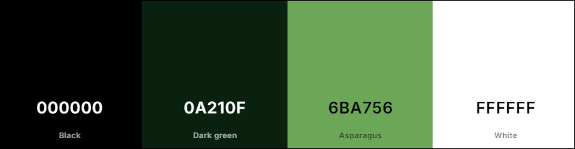

# EireWheels Car Rental

## Table of Contents

- [Overview](#overview)
- [UX](#ux)
   * [Strategy](#strategu)
   * [Database structure](#database-structure)
   * [Design](#design)
- [Technologies](#technologies)
- [Testing](#testing)

<!-- - [Features](#Features)
   * [Welcome block](#Welcome-block)
   * [Menu](#Menu)
   * [Game](#Game)
   * [Finish game](#Finish-game)
   * [Leaderboard](#Leaderboard)
   * [Rules of the game](#Rules-of-the-game)

- [Deployment](#Deployment)
   * [Create Repository](#Create-Repository)
   * [Clone my repository from GitHub to VSCode](#Clone-my-repository-from-GitHub-to-VSCode)
   * [Creating the Heroku app](#Creating-the-Heroku-app)
- [Credits](#Credits) -->

### Overview
EireWheels Car Rental is a web application for car rental developed with Django. The project allows users to view available cars at various airports in Ireland, book them, and manage rentals. This website was created as a learning exercise for my fourth portfolio project at Code Institute.

#### First Time User
- As a person who is visiting Ireland for vacation and is looking for a convenient car rental service.
- As a person who is searching for clear information about available cars and rental services.
- As a person who prefers to make bookings online rather than speaking with others.

#### Returning User
- As a returning user, I would like to review all my previous car rental bookings.
- As a returning user who already has an account, I would like to quickly and easily make a reservation for a specific car.
- As a returning user, I would like to see updates to the available vehicles and services on the site so that I can find new and interesting options (for example, new car models).

## UX

### Strategy

### Database structure
After deciding on the project's features, I used Lucidchart to plan the database structure. The diagram below serves as an initial guide, illustrating the types of data and their relationships.

### Design

#### Colours

The following colour palette was used from [Coolors](https://coolors.co/):

#### Wireframes

The website is designed to be clear and simple. To create a wireframe I used Balsamiq software. PDF file with my wireframe you cand find [here](static/images/readme_images/car_rental.pdf).

## Technologies

This project was created using the following:

### Languages Used
- HTML5
- CSS3
- JavaScript
- Python

### Frameworks Used
- Django - Python framework, used to create the full-stack web application
- Bootstrap 5 - front end framework, helps me with fast and efficient styling

### Databases Used
- PostgreSQL from Code Institute - used as the database
- Cloudinary - used to host the static files

### Validators Used
- W3C HTML Validator - used to validate HTML code
- W3C CSS Validator - used to validate CSS code
- JShint - used to validate JavaScript code
- CI Python Linter - used to validate the Python code

### Other
- Balsamiq - used to create a wireframe
- Lucid.app - used to create a Database ER diagram
- Сodeinstitute-ide - used to code the website
- Django Template Language - templating engine
- GitHub - for storing the code and for the projects Kanban board
- Heroku - for hosting and deployement of this project
- Google Chrome Developer Tools - used during testing, debugging and making the website responsive
- Google Fonts - used to import fonts
- Git - version control tool
- Font Awesome - used for the icons on the website
- Coolors.co - used to choose the colours
- Design.com - used to create logo
- Am I Responsive - to show the website image on a range of devices

## Testing

For a comprehensive overview of the testing strategy, including detailed information on both automated and manual testing, please refer to the [Testing Documentation](TESTING.md).
