# Table of Contents

<!-- - [User Story Testing](#user-story-testing) -->
- [Code Validation](#code-validation)
  - [HTML](#html)
  - [CSS](#css)
  - [JavaScript](#javascript)
  - [Python](#python)
- [Responsiveness and Device Testing](#responsiveness-and-device-testing)
- [Browser Testing](#browser-testing)

## Code Validation

### HTML

All HTML pages were validated using the [W3C HTML Validator](https://validator.w3.org/), and no errors were detected.
| Page                                                                                                                                     | Result              |
| ---------------------------------------------------------------------------------------------------------------------------------------- | ------------------- |
| 

Home

                      | <mark>PASS</mark>   |
| 

Booking

                | <mark>PASS</mark>   |
| 

Booking Form

      | <mark>PASS</mark>   |
| 

Locations

            | <mark>PASS</mark>   |
| 

Contact Us

          | <mark>PASS</mark>   |
| 

My profile

          | <mark>PASS</mark>   |
| 

My bookings

        | <mark>PASS</mark>   |
| 

Edit Booking

      | <mark>PASS</mark>   |
| 

Delete Booking

  | <mark>PASS</mark>   |
| 

Leave Review

      | <mark>PASS</mark>   |
| 

All Reviews

        | <mark>PASS</mark>   |
| 

My Reviews

          | <mark>PASS</mark>   |
| 

Edit Review

        | <mark>PASS</mark>   |
| 

Delete Review

    | <mark>PASS</mark>   |
| 

Sign In

                  | <mark>PASS</mark>   |
| 

Sign Up

                 | <mark>PASS</mark>   |
| 

Log Out

                 | <mark>PASS</mark>   |

### CSS

During the CSS validation process for this project, a couple of issues were identified that are related to the external CSS resource provided by Leaflet. Specifically:

- Mix-blend-mode Value: The plus-lighter value used in the Leaflet CSS file is not recognized as a valid mix-blend-mode value.
- Behavior Property: The behavior property with the value url(#default#VML) is not supported.
These issues are due to the external Leaflet CSS file hosted at https://unpkg.com/leaflet@1.9.4/dist/leaflet.css, and not from the custom CSS within this project. As such, they cannot be resolved directly within this project.

If you encounter validation issues or errors related to these external resources, please be aware that they originate from the external library and not from the project's own CSS.

### JavaScript

| File JS                                                                                                                                              | Result              |
| ---------------------------------------------------------------------------------------------------------------------------------------------------- | ------------------- |
| 

script.js

        | <mark>PASS</mark>   |
| 

rating.js

        | <mark>PASS</mark>   |
| 

Embedded within the Home Page

               | <mark>PASS</mark>   |
| 

Embedded within the Locations Page

        | <mark>PASS</mark>   |
| 

Embedded within the My Bookings Page

        | <mark>PASS</mark>   |
| 

Embedded within the Edit Review Page

        | <mark>PASS</mark>   |

Some of the JavaScript files in this project include Django template variables. When these files are validated using JSHint or similar tools, errors may occur due to the validator not recognizing these Django variables.
For instance, you might encounter errors like:
- 2	Expected '}' to match '{' from line 2 and instead saw '{'.
- 2	Missing semicolon.
- 2	Expected an assignment or function call and instead saw an expression.
- 2	Missing semicolon.
- 2	Unrecoverable syntax error. (2% scanned).

This error occurs because the validator doesn't interpret the Django template syntax correctly. When the Django variables are removed, the validation errors disappear.

| File JS                                                                                                                                              | Result              |
| ---------------------------------------------------------------------------------------------------------------------------------------------------- | ------------------- |
| 

Embedded within the Booking-form Page

        | <mark>ERROR</mark>   |
| 

Embedded within the Car Search Page

        | <mark>ERROR</mark>   |
| 

Embedded within the Edit Booking Page

        | <mark>ERROR</mark>   |

### Python

All Python files were processed using the [CI Python Linter](https://pep8ci.herokuapp.com/), and no errors were found.

#### Bookings app

| Python File                                                                                                                                               | Result              |
| ---------------------------------------------------------------------------------------------------------------------------------------------------- | ------------------- |
| 

admin.py

        | <mark>PASS</mark>   |
| 

apps.py

        | <mark>PASS</mark>   |
| 

cron.py

        | <mark>PASS</mark>   |
| 

forms.py

        | <mark>PASS</mark>   |
| 

models.py

        | <mark>PASS</mark>   |
| 

test_forms.py

        | <mark>PASS</mark>   |
| 

test_views.py

        | <mark>PASS</mark>   |
| 

urls.py
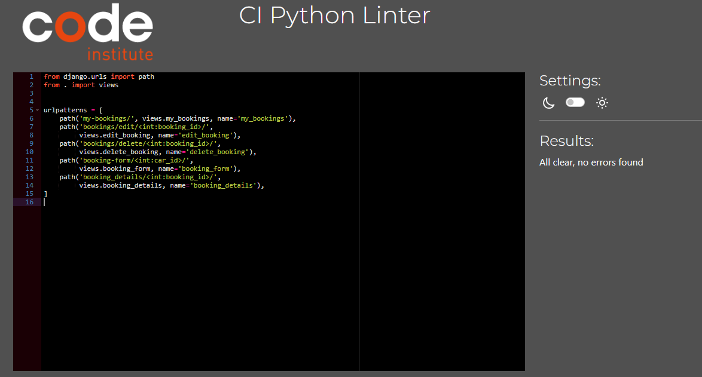
        | <mark>PASS</mark>   |
| 

views.py

        | <mark>PASS</mark>   |

#### Cars app
| Python File                                                                                                                                               | Result              |
| ---------------------------------------------------------------------------------------------------------------------------------------------------- | ------------------- |
| 

admin.py

        | <mark>PASS</mark>   |
| 

apps.py

        | <mark>PASS</mark>   |
| 

models.py

        | <mark>PASS</mark>   |
| 

test_views.py

        | <mark>PASS</mark>   |
| 

urls.py

        | <mark>PASS</mark>   |
| 

views.py

        | <mark>PASS</mark>   |

#### Offices app
| Python File                                                                                                                                               | Result              |
| ---------------------------------------------------------------------------------------------------------------------------------------------------- | ------------------- |
| 

admin.py

        | <mark>PASS</mark>   |
| 

apps.py

        | <mark>PASS</mark>   |
| 

models.py

        | <mark>PASS</mark>   |
| 

test_views.py

        | <mark>PASS</mark>   |
| 

urls.py

        | <mark>PASS</mark>   |
| 

views.py

        | <mark>PASS</mark>   |

#### Userprofile app

| Python File                                                                                                                                               | Result              |
| ---------------------------------------------------------------------------------------------------------------------------------------------------- | ------------------- |
| 

admin.py

        | <mark>PASS</mark>   |
| 

apps.py

        | <mark>PASS</mark>   |
| 

forms.py

        | <mark>PASS</mark>   |
| 

models.py

        | <mark>PASS</mark>   |
| 

signal.py

        | <mark>PASS</mark>   |
| 

test_data.py

        | <mark>PASS</mark>   |
| 

test_forms.py

        | <mark>PASS</mark>   |
| 

test_views.py

        | <mark>PASS</mark>   |
| 

urls.py

        | <mark>PASS</mark>   |
| 

views.py

        | <mark>PASS</mark>   |

#### Car rental project

| Python File                                                                                                                                               | Result              |
| ---------------------------------------------------------------------------------------------------------------------------------------------------- | ------------------- |
| 

asgi.py

        | <mark>PASS</mark>   |
| 

settings.py

        | <mark>PASS</mark>   |
| 

urls.py

        | <mark>PASS</mark>   |
| 

wsgi.py

        | <mark>PASS</mark>   |

## Responsiveness and Device Testing

Throughout the development process, the website was rigorously tested across a range of devices, including desktops, laptops, smartphones, and tablets. This testing ensured that the website displayed correctly on screens of various sizes and orientations, both portrait and landscape. Additionally, the responsive design was validated using Google Chrome's developer tools to confirm that the layout remained structurally sound and adaptable across different screen dimensions. No issues were noted, affirming that the site functions as expected across diverse environments.

## Browser Testing

The website was tested across Google Chrome, Safari, and Microsoft Edge, and no issues were found.

## Lighthouse Testing

Lighthouse validation was run on all pages (both mobile and desktop) in order to check performance, accessibility, best practices and CEO.

| Page            | Performance | Accessibility | Best Practices | SEO | Screenshot                                                                                                                  |
| --------------- | :---------: | :-----------: | :------------: | :-: | --------------------------------------------------------------------------------------------------------------------------- |
|                 |             |               |                |     |
| **Desktop**     |             |               |                |     |
| Home            |     99      |      98      |      100       | 100 | 

Home
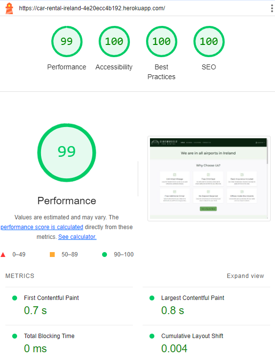
                    |
| Booking            |     100      |      92      |      100       | 100 | 

Booking

                    |
| Locations            |     97      |      96      |      100       | 100 | 

Locations

                    |
| Contact Us            |     100      |      100      |      100       | 100 | 

Contact Us

                    |
| Booking Form            |     100      |      89      |      78       | 100 | 

Booking Form
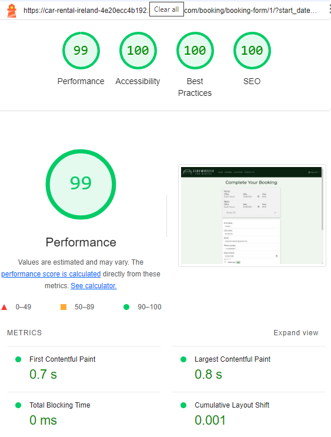
                    |
| Edit Booking            |     99      |      89      |      78       | 100 | 

Edit Booking
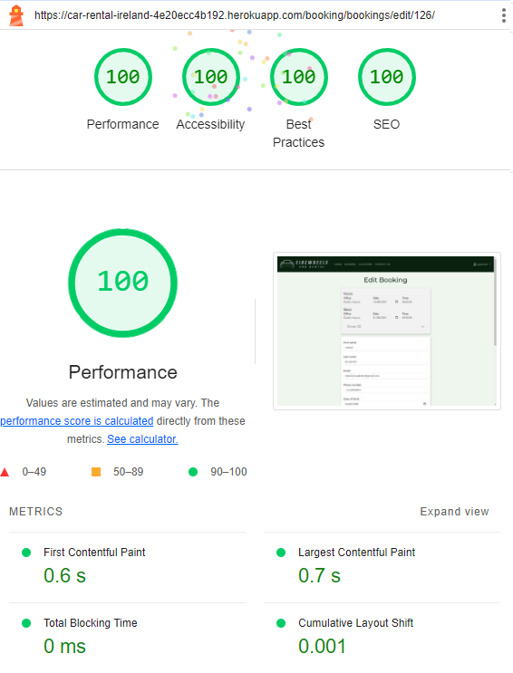
                    |
| Delete Booking            |     100      |      100      |      100       | 100 | 

Delete Booking

                    |
| All Reviews            |     100      |      100      |      100       | 100 | 

All Reviews

                    |
| Leave Review            |     100      |      96      |      100       | 100 | 

Leave Review

                    |
| Edit Review            |     99      |      96      |      100       | 100 | 

Edit Review 

                    |
| Delete Review            |     99      |      100      |      100       | 100 | 

Delete Review 

                    |
| My Profile            |     100      |      100      |      100       | 100 | 

My Profile
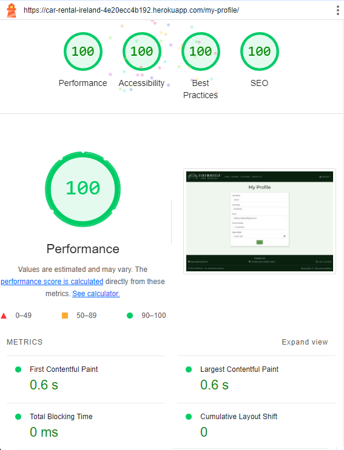
                    |
| My Bookings            |     97      |      92      |      78       | 100 | 

My Bookings

                    |
| My Reviews            |     99      |      87      |      100       | 100 | 

My Reviews
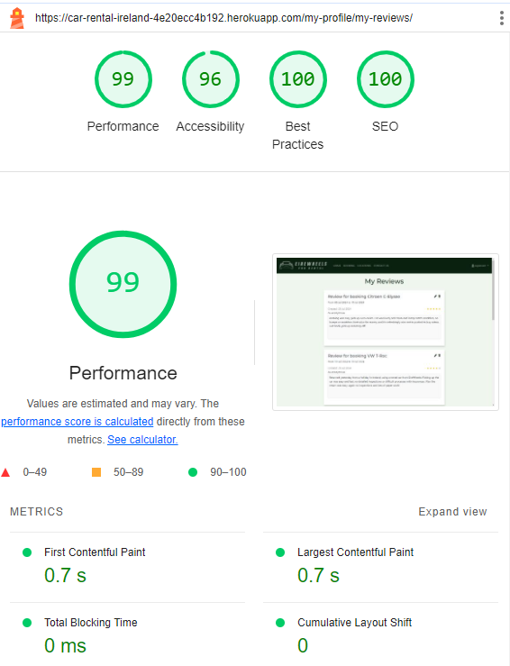
                    |
| Sign In            |     100      |      100      |      100       | 100 | 

Sign In

                    |
| Sign Up            |     100      |      100      |      100       | 100 | 

Sign Up

                    |
| Sign Out            |     100      |      100      |      100       | 100 | 

Sign Out
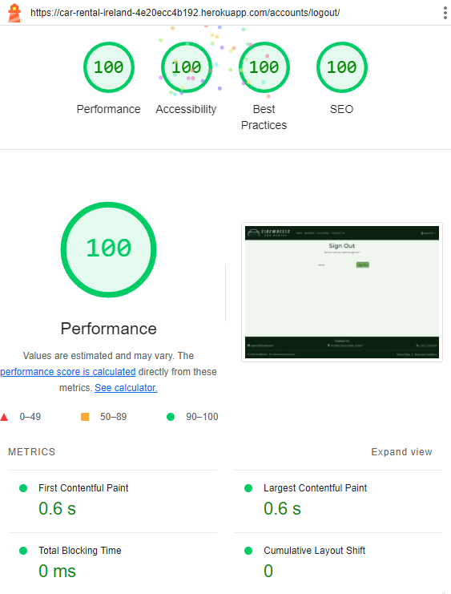
                    |
|                 |             |               |                |     |
| **Mobile**      |             |               |                |     |
| Home            |     93      |      98      |      100       | 100 | 

Home
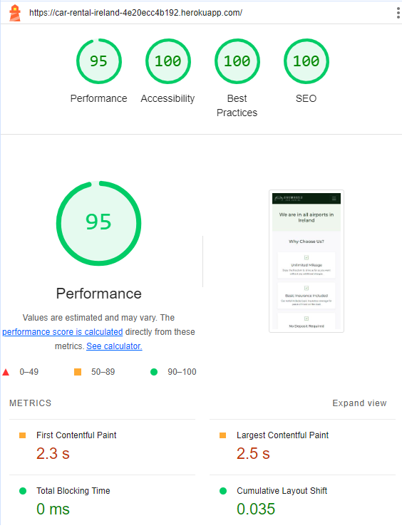
                    |
| Booking            |     96      |      91      |      100       | 100 | 

Booking

                    |
| Locations            |     77      |      96      |      96       | 100 | 

Locations

                    |
| Contact Us            |     94      |      100      |      100       | 100 | 

Contact Us

                    |
| Booking Form            |     92      |      86      |      79       | 100 | 

Booking Form

                    |
| Edit Booking            |     93      |      86      |      79       | 100 | 

Edit Booking
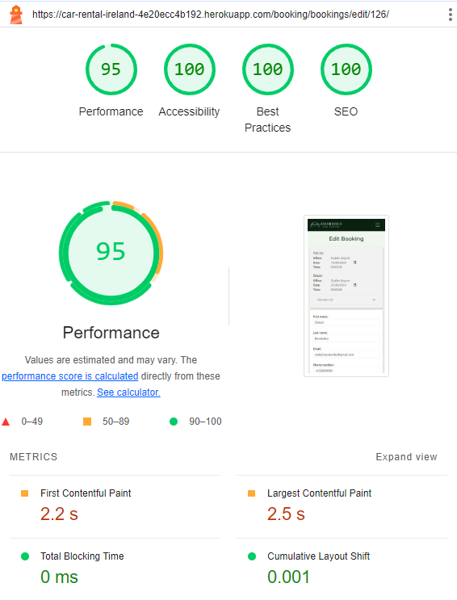
                    |
| Delete Booking            |     93      |      100      |      100       | 100 | 

Delete Booking

                    |
| All Reviews            |     92      |      100      |      100       | 100 | 

All Reviews

                    |
| Leave Review            |     92      |      95      |      100       | 100 | 

Leave Review

                    |
| Edit Review            |     96      |      95      |      100       | 100 | 

Edit Review 

                    |
| Delete Review            |     91      |      100      |      100       | 100 | 

Delete Review 

                    |
| My Profile            |     94      |      100      |      96       | 100 | 

My Profile
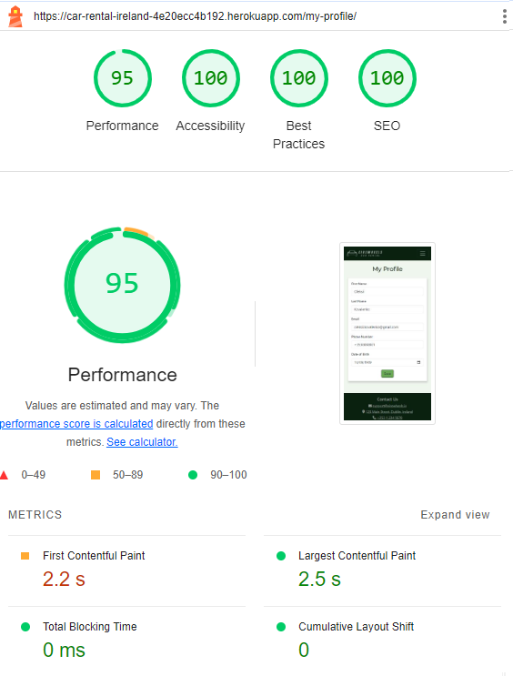
                    |
| My Bookings            |     87      |      90      |      79       | 100 | 

My Bookings

                    |
| My Reviews            |     93      |      85      |      100       | 100 | 

My Reviews
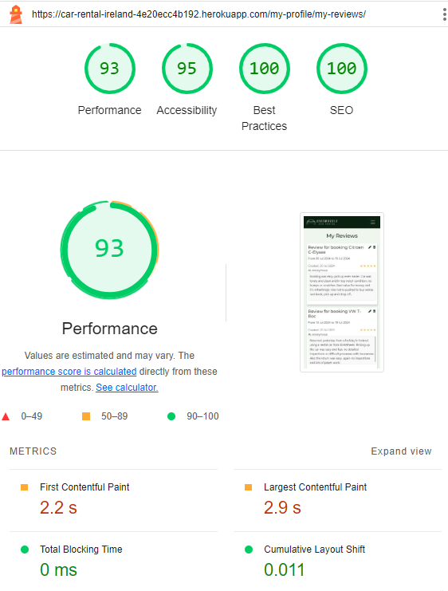
                    |
| Sign In            |     92      |      100      |      100       | 100 | 

Sign In
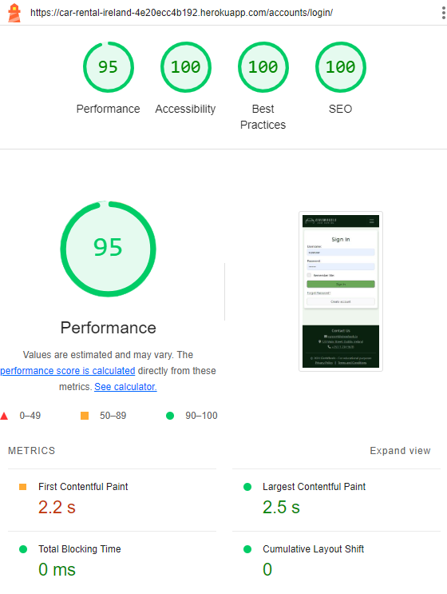
                    |
| Sign Up            |     93      |      100      |      100       | 100 | 

Sign Up

                    |
| Sign Out            |     92      |      100      |      100       | 100 | 

Sign Out

                    |
